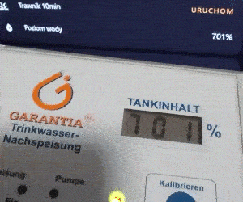

## Background

I have a rainwater tank from Garantia buried in my backyard. It has a controller module like this


and that module shows the water level percentage on a 3-digit 7-segment display.
That module is in my garage and the only way to check the water level is to actually go there and read it from the display. All my lawn sprinklers are automated in Home Assistant, but it often happens that there is a longer period without rain and the level is approaching 0%. Ideally I want to have the water level value in Home Assistant and include it in the automation to decide how much water do I want to use and also see the statistics over time.

## Problems
- Current hardware has to stay as is, ie. I can't replace the sensor to a smart one. The water tank and all wires/connections were buried a long time ago and I can't run a new cable from my garage to the water tank (they are currently running under the driveway).
- I don't want to use any battery/wireless based hardware as that's a maintenance burden and additional point of failure


## Possible solutions
- Set up a small camera (eg. ESP32-cam) pointing to the module's LCD and display the image in the dashboard. Doable but the value can't be used in automations. I could add an additional OCR, but that's way too fragile
- Plug myself between the sensor and the module. That is not ideal because it can introduce inconsistencies between values read by the module and my new hardware, because of the sensor calibration (which is stored in the module). Also, that sensor is not easy to interface with since it uses 12V modulated signal
- Plug myself to the LCD display connections. It's the simplest solution (since it's either 5V meaning segment is on and 0 if it's off). Easy, but not great because I have to wire 24 pins of the LCD to the ESP32, which will take quite a bit of space. Maybe we can do better?

## Let's open the module


Inside the module we can see an ATtiny2313 which is connected to the LCD display through 3 BCD-to-Seven Segment Latch drivers [MC14543B](https://www.onsemi.com/download/data-sheet/pdf/mc14543b-d.pdf).

The way these drivers work is that you use only 4 signals to send a BCD-encoded digit value (simply 4 bits binary) and use the Latch signal to "store" it in the driver, which then enables the correct LCD segments.

All 3 drivers share the same ABCD lanes, and they have separate Latch ("activate") pins. ATtiny MCU simply runs in a loop and outputs each digit sequentially on the ABCD lanes and enables/disables appropriate Latch pin for given digit.

The PCB traces under the display are roughly as follows


It seems like we can just hook up the ABCD + L1/L2/L3 pins and we're good? Way better than reading 24 pins.

# Hardware
We'll need a ESPHome-compatible board to read the digital values at these pins. The signals are 5V so we'll also need to convert them to 3.3V. Let's use [ESP32-S3-Zero](https://www.waveshare.com/esp32-s3-zero.htm) and [TXS0108E](https://aliexpress.com/i/4001172918547.html)!

They are small and easy to solder together. The final connection schematic is like this:


### Let's solder everything together and connect to our module


# Software

Now that we have our ESP32 connected to the pins we want to read, let's try to simply read the GPIO and decode the value shown on the LCD.

Let's first try to use ESP-IDF directly to make sure we can even read the value and that we're not interfered by anything else like WiFi

```c
#define A 10
#define B 7
#define C 8
#define D 9
#define L1 11
#define L2 12
#define L3 13

void conf(int pin) {
    gpio_reset_pin(pin);
    gpio_set_direction(pin, GPIO_MODE_INPUT);
    gpio_set_pull_mode(pin, GPIO_PULLDOWN_ONLY);
}
void app_main() {
    // Configure the pins as INPUT
    conf(A); conf(B); conf(C); conf(D); conf(L1); conf(L2); conf(L3);

    // Variables for each digit
    int d1 = 0;
    int d2 = 0;
    int d3 = 0;

    int i = 0;
    while (1) {
        // Read the 4-bit number value from ABCD pins
        int digit = (gpio_get_level(A) << 0) |
                    (gpio_get_level(B) << 1) |
                    (gpio_get_level(C) << 2) |
                    (gpio_get_level(D) << 3);

        // If Latch 1 is active, the first digit is at the ABCD pins, and so on
        if (gpio_get_level(L1)) d1 = digit;
        if (gpio_get_level(L2)) d2 = digit;
        if (gpio_get_level(L3)) d3 = digit;

        // Periodically print the values
        if (i % 200000 == 0) {
            ESP_LOGI(TAG, "%d%d%d", d1, d2, d3);
            vTaskDelay(10 / portTICK_PERIOD_MS);
        }
        i++;
    }
}
```

That should be roughly it. Let's test it!


It works! almost... sometimes...

What's wrong? Oh right, we have to use interrupts to catch the L1/L2/L3 values, if we want to make sure we read the correct digit at that **exact** time.

```c
#define A 10
#define B 7
#define C 8
#define D 9
#define L1 11
#define L2 12
#define L3 13

static QueueHandle_t gpio_evt_queue = NULL;

static volatile int d1 = 0;
static volatile int d2 = 0;
static volatile int d3 = 0;

struct ISRMSG {
    uint32_t pin;
    uint32_t val;
};

static void IRAM_ATTR gpio_isr_handler(void *arg) {
    // Interrupt at the Latch pin.
    // Read the ABCD state and send the value via the task queue
    struct ISRMSG msg = {
        .pin = (uint32_t) arg,
        .val = (gpio_get_level(A) << 0) |
               (gpio_get_level(B) << 1) |
               (gpio_get_level(C) << 2) |
               (gpio_get_level(D) << 3)
    };
    xQueueSendToBackFromISR(gpio_evt_queue, &msg, NULL);
}

void confisr(int pin) {
    gpio_config_t io_conf = {};
    io_conf.intr_type = GPIO_INTR_POSEDGE;
    io_conf.pin_bit_mask = (1ULL << pin);
    io_conf.mode = GPIO_MODE_INPUT;
    io_conf.pull_down_en = 1;
    io_conf.pull_up_en = 0;
    gpio_config(&io_conf);
    gpio_isr_handler_add(pin, gpio_isr_handler, (void *)pin);
}
void conf(int pin) {
    gpio_reset_pin(pin);
    gpio_set_direction(pin, GPIO_MODE_INPUT);
    gpio_set_pull_mode(pin, GPIO_PULLDOWN_ONLY);
}

static void gpio_task(void *) {
    struct ISRMSG msg;
    for (;;) {
        if (xQueueReceive(gpio_evt_queue, &msg, portMAX_DELAY)) {
            switch (msg.pin) {
                case L1: d1 = msg.val; break;
                case L2: d2 = msg.val; break;
                case L3: d3 = msg.val; break;
            }
        }
    }
}
void app_main() {
    gpio_evt_queue = xQueueCreate(50, sizeof(struct ISRMSG));

    // Create a task to read values from the ISR
    xTaskCreate(gpio_task, "gpio_task", 4096, NULL, 10, NULL);

    // Configure the ABCD pins
    conf(A); conf(B); conf(C); conf(D);

    // Configure the interrupts
    gpio_install_isr_service(ESP_INTR_FLAG_IRAM);
    confisr(L1); confisr(L2); confisr(L3);

    int i = 0;
    while (1) {
        // Periodically print the values
        if (i % 200000 == 0) {
            ESP_LOGI(TAG, "%d%d%d", d1, d2, d3);
            vTaskDelay(10 / portTICK_PERIOD_MS);
        }
    }
}

```


WTF? It's even worse! What gives?

It looks like we're way off with out readings and the ATtiny is bitbanging the drivers pretty quickly. The osciallator on board is 3.68 MHz. But our ESP is running at 160 MHz, so we're plenty fast?!

### GPIO readout speed on ESP32

After many hours of struggling to read accurate digits and trying every possible interrupt configuration I decided to actually check how fast is GPIO readout on ESP32-S3. I did some googling and it turns out that its actually [**pretty damn slow**](https://www.reddit.com/r/esp32/comments/f529hf/results_comparing_the_speeds_of_different_gpio/). At least for what we need.

We can do `gpio_get_level` at about 4 MHz (in 160 MHz mode). That's pretty fast, but we have 7 reads per loop and we end up with the iteration at ~570 kHz. We need 6 times more speed!

### Dedicated GPIO to the rescue

Thankfully ESP32-S3 has a mode called [`Dedicated GPIO`](https://docs.espressif.com/projects/esp-idf/en/latest/esp32s3/api-reference/peripherals/dedic_gpio.html) which allows us to read multiple GPIO pins in a single CPU cycle. That's exactly what we need.

```c
#define A 10
#define B 7
#define C 8
#define D 9
#define L1 11
#define L2 12
#define L3 13

static volatile int d1 = 0;
static volatile int d2 = 0;
static volatile int d3 = 0;

dedic_gpio_bundle_handle_t num_bundle = NULL;
const int num_gpios[] = { A, B, C, D, L1, L2, L3 };

static void gpio_sampler(void* arg) {
    gpio_config_t io_conf = { .mode = GPIO_MODE_INPUT, };
    for (int i = 0; i < 7; i++) {
        io_conf.pin_bit_mask = 1ULL << num_gpios[i];
        gpio_config(&io_conf);
    }
    dedic_gpio_bundle_config_t config = {
        .gpio_array = num_gpios,
        .array_size = 7,
        .flags = { .in_en = 1 }
    };
    ESP_ERROR_CHECK(dedic_gpio_new_bundle(&config, &num_bundle));

    uint32_t v = 0;
    uint32_t pv = 0;
    while (1) {
        v = dedic_gpio_bundle_read_in(num_bundle);
        if (v != pv) {
            if ((v >> 4) & 1) d1 = v & 0xf;
            if ((v >> 5) & 1) d2 = v & 0xf;
            if ((v >> 6) & 1) d3 = v & 0xf;
        }
        pv = v;
    }
}
void app_main() {
    xTaskCreatePinnedToCore(&gpio_sampler, "gpio_sampler", 4096, NULL, 1, NULL, 1);

    int i = 0;
    while (1) {
        if (i % 400000 == 0) {
            ESP_LOGI(TAG, "%d%d%d", d1, d2, d3);
            vTaskDelay(10 / portTICK_PERIOD_MS);
        }
        i++;
    }
}
```

Yay! It works!

The only thing left is to write an ESPHome [external component](https://esphome.io/components/external_components.html). It was pretty straightforward, I simply used the code above and a sample sensor from ESPHome's `components/demo/`.

## Let's put it back together.

So everything works, I have the LCD values in Home Assistant dashboard so I put the board back in the original module, screw everything in and mount it back in the garage.

### ...and it doesn't work.


The LCD screen constantly blinks and ESP doesn't connect to the WiFi at all.

But it just worked 2 minutes ago?

I disassemble the module again, I connect the USB do ESP32 to check the logs and... it works? Ohhh right, we have the USB power. It appears that the power supply in the module is unable to power both ATtiny and ESP32 now. Let's see how much mA it delivers
> The MC78L00A Series of positive voltage regulators are inexpensive, easy−to−use devices suitable for a multitude of applications that require a regulated supply of up to **100 mA**.

ESP32 needs about ~350 mA, so yeah, we're a bit short.

Thankfully I found a pin-to-pin compatible 12V->5V regulator [KF50BD-TR](https://www.st.com/resource/en/datasheet/kfxx.pdf) (or [L4931ABD50-TR](https://www.st.com/resource/en/datasheet/l4931.pdf) or [LT1763CS8-5PBF](https://www.analog.com/media/en/technical-documentation/data-sheets/1763fh.pdf)) which we can just replace.

And just like that it's fixed and now it finally fully works as expected! Yay!


