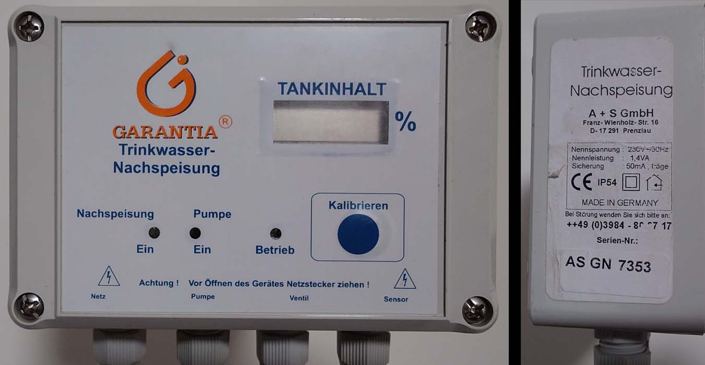
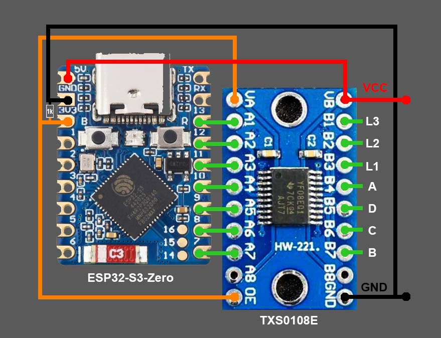
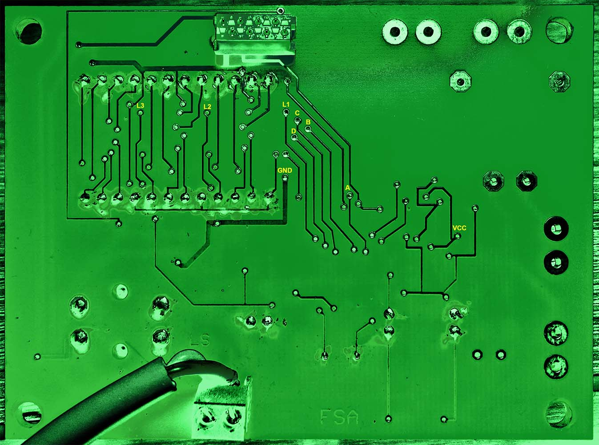
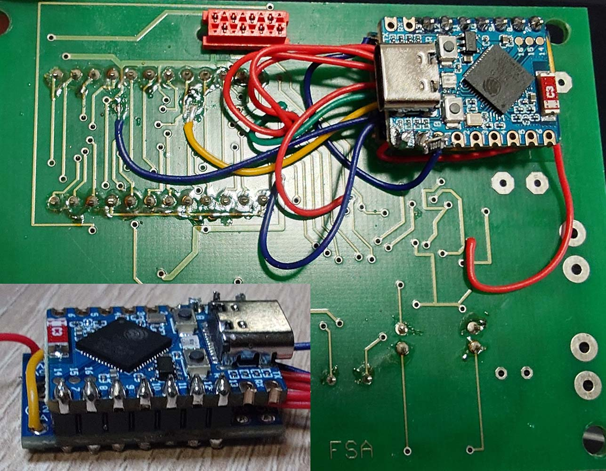
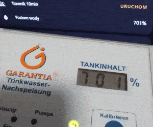
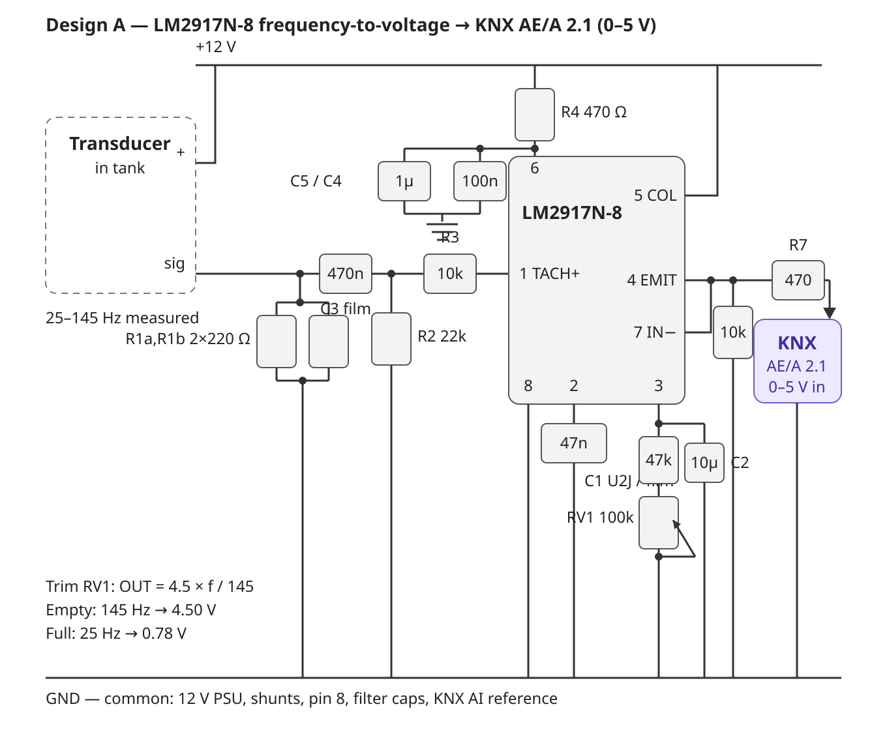
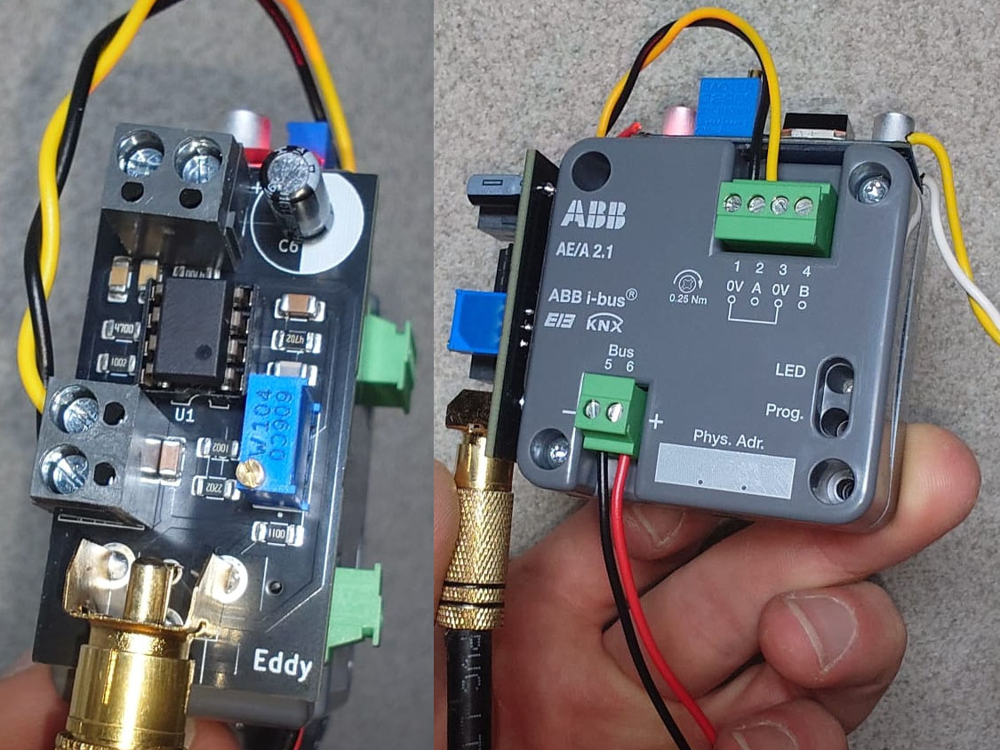
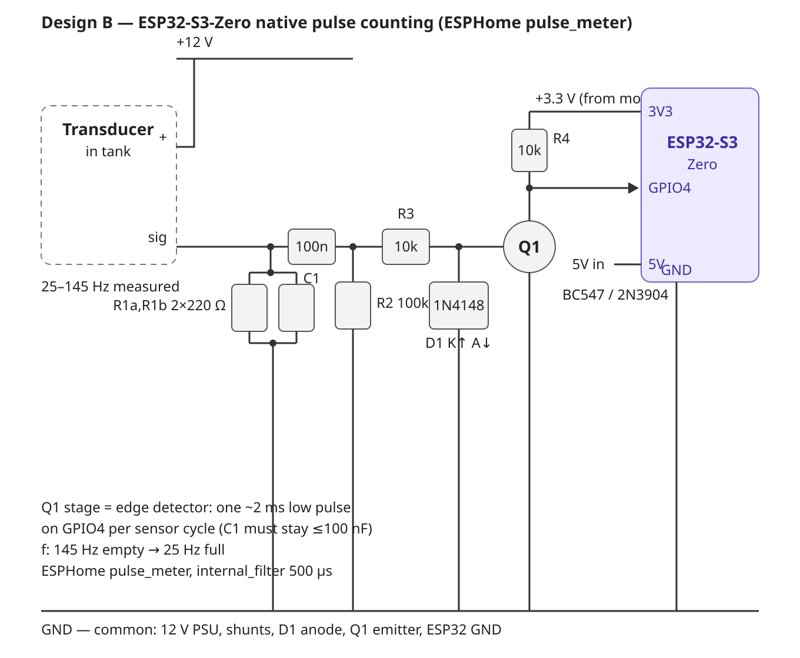

# Garantia water tank level sensor for ESPHome / KNX

So you have an old-fashioned water tank level module like this one



and you want to see the percentage in your Home Assistant dashboard? Let's do it!

Two ways to get there:

- **V1** – keep the original controller, sniff its display signals with an ESP32 (below).
- **V2** – replace the controller with a small board that talks to the tank sensor directly:
  analog 0–5 V output (KNX or ESP32 ADC), or ESP32 pulse counting with a single transistor. [Jump to V2](#v2--replacing-the-controller).

---

# V1 – reading the original controller

## 0. [What? How?](HOW.md)

## 1. Required hardware
- [ESP32-S3-Zero](https://www.waveshare.com/esp32-s3-zero.htm)
- [TXS0108E](https://aliexpress.com/i/4001172918547.html)

## 2. Connections




You also have to replace the on-board voltage regulator **8L05A** to a more powerful one [KF50BD-TR](https://www.st.com/resource/en/datasheet/kfxx.pdf)

## 3. ESPHome component

```yaml
esphome:
  name: garantia-water-level
  platformio_options: # needed for ESP32-S3
    board_build.flash_mode: dio

esp32:
  board: adafruit_feather_esp32s3
  framework:
    type: esp-idf

external_components:
  - source: github://AdrianEddy/esphome-garantia-water-level
    components: [ garantia-water-level ]

sensor:
  - platform: garantia-water-level
```

## Final assembly



## See it in action



---

# V2 – replacing the controller

The tank-side electronics (the small box in the tank + the red/white sensor cord) are fine and stay untouched.
Only the indoor box gets replaced.

## What the sensor actually does (research, short version)

Reverse-engineered from the original PCB and measured with a scope – **the manual is misleading here**:

- The tank box is a capacitance-to-frequency converter on a **2-wire current loop**: the controller sends +12 V on one RCA contact, the sensor's return current comes back on the other contact through a **110 Ω shunt** (2×220 Ω on the original PCB). The current is pulsed – that's the signal.
- Signal across the shunt: **≈1.7 V pk-pk**, square-ish, ~35/65 duty, on ~3 V DC (the sensor draws ≈27 mA).
- **Frequency: ~145 Hz with an empty tank, ~25 Hz with a full tank.** More water → lower frequency.
  The "200 Hz – 20 kHz" in the manual is *not* what comes down the cable – ignore it.
- Level is **linear in period**, not frequency: `level = (1/f − 1/f_empty) / (1/f_full − 1/f_empty)`.
- The original controller is an ATtiny2313 counting that frequency with its internal comparator. No magic.

Conclusions that saved parts:
- The signal is big enough that **no comparator is needed** – an LM2917 or a single transistor reads it directly.
  (Only if your sensor variant gives < 300 mVpp would you need an LM393-style comparator in front.)
- The one critical component is the LM2917 timing cap C1 – it sets the gain: **C0G / U2J / film only**, never X7R.
- Frequencies are installation specific (cord length, tank). **Measure yours** before picking values.
- If your original controller reads unstable, check its wall adapter first – ours had sagged to 10 V.

## Measure your sensor first

1. Power the tank box with 12 V through a 110 Ω shunt to GND (the V2 board does exactly this).
2. Scope across the shunt, **AC coupling**, 0.5 V/div, 10 ms/div. Note the frequency.
3. Record `f_empty` (pump can't take more out) and `f_full` (water at the overflow). Optional sanity check:
   a period-linear sensor sits at `2 / (1/f_empty + 1/f_full)` at 50 % (≈43 Hz for 145/25).

Everything below is parameterised on `f_empty` and `f_full`.

## Which option?

| You want | Use |
|---|---|
| An **analog 0–5 V signal** – KNX analog input (e.g. ABB AE/A 2.1) or ESP32 ADC | **Option A – LM2917** |
| Just an ESP32 in Home Assistant, best accuracy, fewest parts | **Option B – transistor + `pulse_meter`** |

Common to both: 12 V DC supply, RCA jack (contact A = +12 V feed, contact B = signal), 110 Ω shunt from signal to GND, one common GND.

**Power:** a Mean Well HDR-15-12 works, but in the KNX version I skipped the extra PSU altogether: the **yellow/white pair** of the KNX cable
carries the 30 V *auxiliary* (unchoked) output of the KNX power supply, and a cheap DC-DC buck module (LM2596-type, rated ≥36 V in)
drops it to 12.0 V. The board draws ~20 mA at 30 V. Take it only from the auxiliary output / yellow-white pair – **never from the
red/black bus pair**, which carries the telegrams and must not see a switching load.

---

### Option A – LM2917 frequency-to-voltage (KNX / analog)



**KiCad project (schematic + PCB, JLCPCB-ready):** [hardware/garantia-lm2917-kicad.zip](hardware/garantia-lm2917-kicad.zip)
– the 1206/SOIC parts can be assembled by JLCPCB PCBA; DIP LM2917, trimmer and connectors are hand-soldered.



Transfer function: **V_OUT = 7.56 V × f × C1 × R1**. Design for ~4.5 V at `f_empty` (headroom below the 5 V input range):

```
C1 × R1 = 4.5 / (7.56 × f_empty)          # f_empty = 145 Hz → 4.1e-3
pick C1 so R1 lands mid-trimmer (47k fixed + 100k trim):  145 Hz → C1 = 47 nF, R1 ≈ 87 k
charge-pump limit:  f_empty < 140e-6 / (C1 × 7.56)        # 47 nF → 394 Hz max
```

Values as built (f_empty 145 Hz, f_full 25 Hz):

| Ref | Value | Notes |
|---|---|---|
| R1 | 110 Ω (or 2×220 Ω) | shunt |
| C3, R2, R3 | 470 nF film, 22 k, 10 k | AC coupling into pin 1 |
| R4, C4, C5 | 470 Ω, 1 µF, 100 nF | pin 6 (internal 7.56 V zener) |
| C1 | **47 nF C0G / U2J / film** | pin 2 – gain critical |
| R5 + RV1, C2 | 47 k + 100 k trimmer (rheostat), 10 µF | pin 3 – gain trim + filter |
| R6, R7 | 10 k, 470 Ω | output load + series; pin 7 strapped to pin 4, pin 5 to +12 V |

Output: empty 145 Hz → **4.50 V**, full 25 Hz → **0.78 V**. Voltage at level L: `V = 4.5 / (1 + (f_empty/f_full − 1)·L)`.

**Trim:** turn RV1 until `OUT = 4.5 × f / f_empty` at any known frequency (full tank → 0.78 V).

**KNX (ABB AE/A 2.1):** channel = voltage 0–5 V, output as 4-byte float, lower 0 % → 0, upper 100 % → 5 (bus value = volts).
Filter *low* (the 64-sample filter turns a sensor failure into a 60 s fake "filling" ramp). Send on change ≥1 % + cyclic 5 min.
Threshold 1 (valve): ON above 3.04 V (10 %), OFF below 2.86 V (12 %). Threshold 2 (fault): ON below 0.40 V.

**Home Assistant (KNX):**
```yaml
knx:
  sensor:
    - name: "Tank voltage"
      state_address: "5/3/4"
      type: 4byte_float
      device_class: voltage

template:
  - sensor:
      - name: "Rainwater tank level"
        unit_of_measurement: "%"
        state_class: measurement
        state: >
          
             {# voltage at f_empty #}
             {# voltage at f_full  #}
          {{ none }}
          {{ [0, [100, ((1/v - 1/ve) / (1/vf - 1/ve) * 100) | round(0)] | min] | max }}
          
  - binary_sensor:
      - name: "Rainwater tank sensor fault"
        device_class: problem
        state: "{{ states('sensor.tank_voltage') | float(0) < 0.4 }}"
```

**ESP32 ADC instead of KNX:** 10 k / 10 k divider from OUT to GND, tap → GPIO4 (ADC1), common GND.
```yaml
sensor:
  - platform: adc
    pin: GPIO4
    id: tank_v
    attenuation: 12db
    update_interval: 1s
    filters:
      - median: { window_size: 15, send_every: 5 }
      - multiply: 2.0
  - platform: template
    name: "Rainwater tank level"
    unit_of_measurement: "%"
    lambda: |-
      const float VE = 4.50, VF = 0.78;
      float v = id(tank_v).state;
      if (v < 0.4) return NAN;
      return clamp((1.0f/v - 1.0f/VE) / (1.0f/VF - 1.0f/VE) * 100.0f, 0.0f, 100.0f);
```
(The ESP32 ADC is coarse below ~0.15 V – fine for a tank; KNX or Option B is more accurate near full.)

---

### Option B – one transistor + ESPHome (pulse counting)



```
shunt node ─ 100 nF ─┬─ 10k ─┬─ base Q1 (BC547 / MMBT3904)
                     │       └─ D1 1N4148 (cathode at base, anode GND)
                    100k         emitter → GND
                     │           collector ─┬─ 10k → +3.3 V (from the ESP module)
                    GND                     └─ GPIO4
```
The stage is an edge detector: one ~2 ms low pulse on GPIO4 per sensor cycle. **Keep the coupling cap ≤ 100 nF** – a bigger one merges pulses at high frequency.
Power the ESP32-S3-Zero from USB or a 12 V→5 V buck; common GND with the sensor board.

```yaml
sensor:
  - platform: pulse_meter
    pin:
      number: GPIO4
      mode: INPUT
    id: tank_pulse
    name: "Tank sensor frequency"
    unit_of_measurement: "Hz"
    internal_filter: 500us     # pulses are ~2 ms – do NOT use 2 ms
    timeout: 250ms             # no pulse for 250 ms = sensor fault
    filters:
      - multiply: 0.016667     # pulses/min → Hz
      - sliding_window_moving_average: { window_size: 10, send_every: 5 }

  - platform: template
    name: "Rainwater tank level"
    unit_of_measurement: "%"
    state_class: measurement
    update_interval: 10s
    lambda: |-
      const float F_EMPTY = 145.0, F_FULL = 25.0;   // measure yours
      float f = id(tank_pulse).state;
      if (isnan(f) || f < 5.0) return NAN;
      return clamp((1.0f/f - 1.0f/F_EMPTY) / (1.0f/F_FULL - 1.0f/F_EMPTY) * 100.0f, 0.0f, 100.0f);

binary_sensor:
  - platform: template
    name: "Rainwater tank sensor fault"
    device_class: problem
    lambda: return isnan(id(tank_pulse).state) || id(tank_pulse).state < 5.0;
```

Calibration = two constants. Uniform ~1 % resolution across the whole tank, no trimmer, no critical parts.

---

## Top-up valve

Drive it separately from Home Assistant Automation, using any standard output (KNX, ESPHome relays, Tuya etc)

## Debugging notes (things that cost us time)

- Measure frequency at the **shunt**, not at LM2917 pin 1 – the coupling network droops the waveform at low frequency and confuses scope counters.
- A half-full tank gives only a few hundred mV out of the LM2917 – that is correct, the scale is nonlinear (all the resolution sits at the empty end, where the valve decisions are).
- "Empty" depends on residual water on the probe (we saw 125 vs 145 Hz ≈ 3 % of level). Calibrate to your pump-limit state.
