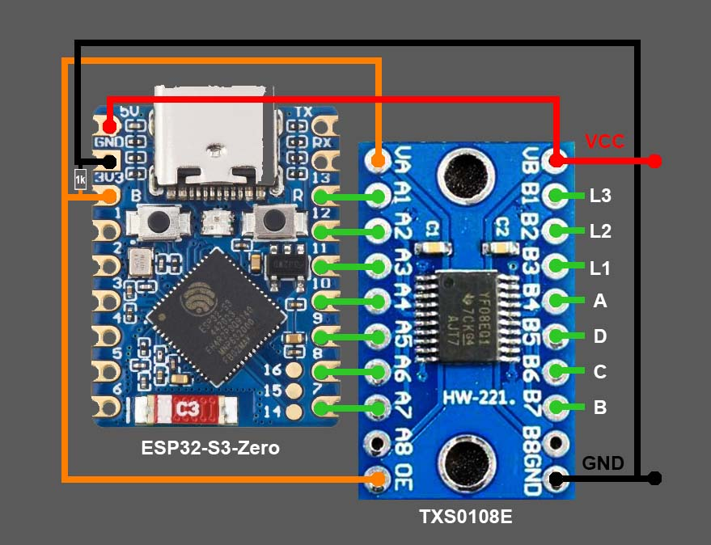

# Garantia water tank level sensor for ESPHome

So you have an old-fashioned water tank level module like this one


and you want to see the percentage in your Home Assistant dashboard? Let's do it!

# 0. [What? How?](HOW.md)

# 1. Required hardware
- [ESP32-S3-Zero](https://www.waveshare.com/esp32-s3-zero.htm)
- [TXS0108E](https://aliexpress.com/i/4001172918547.html)

# 2. Connections




# 3. ESPHome component

```yaml
esphome:
  name: garantia-water-level
  platformio_options: # needed for ESP32-S3
    board_build.flash_mode: dio

esp32:
  board: adafruit_feather_esp32s3
  framework:
    type: esp-idf

external_components:
  - source: github://AdrianEddy/esphome-garantia-water-level
    components: [ garantia-water-level ]

sensor:
  - platform: garantia-water-level
```

# Final assembly


# See it in action


